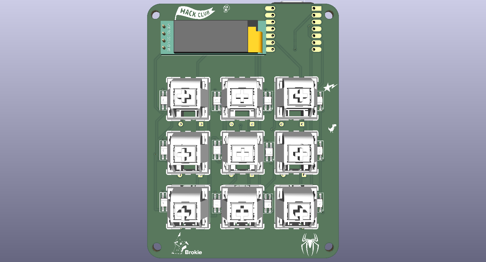
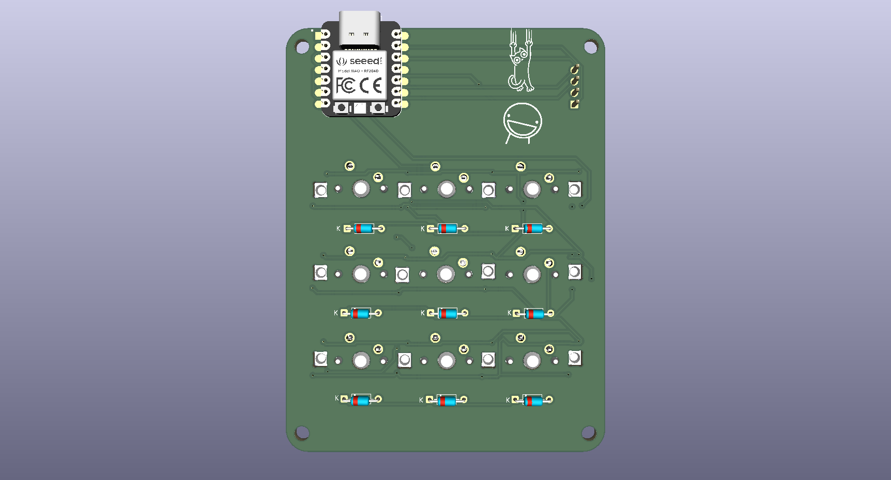
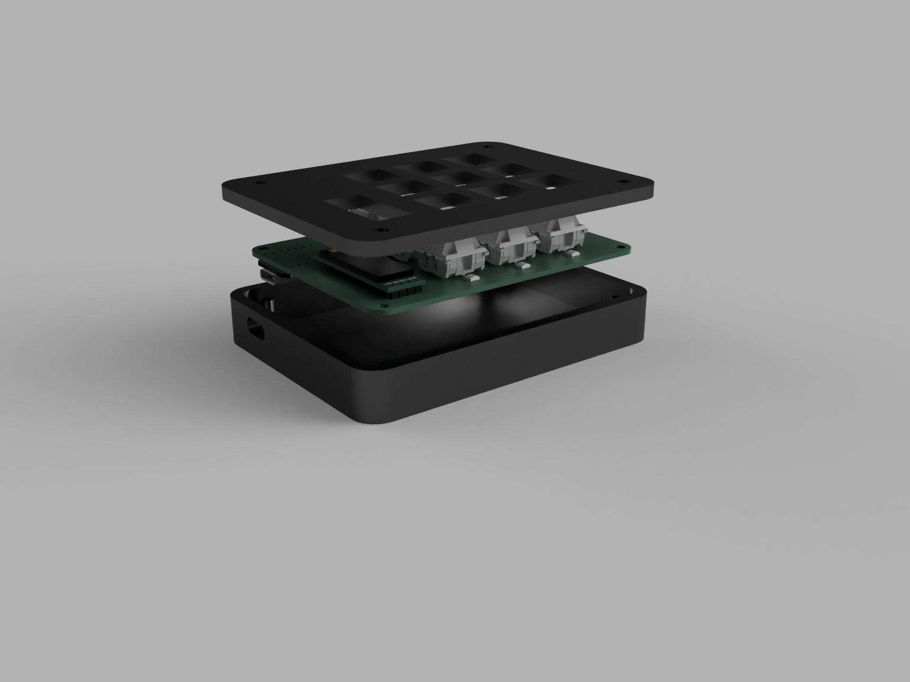
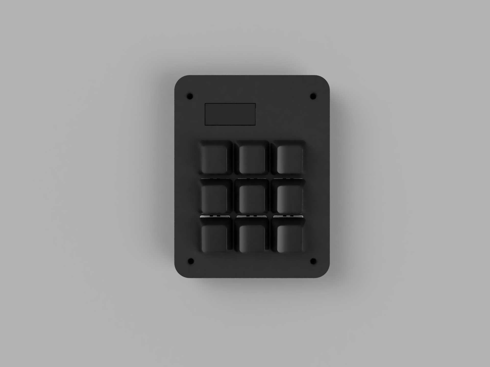
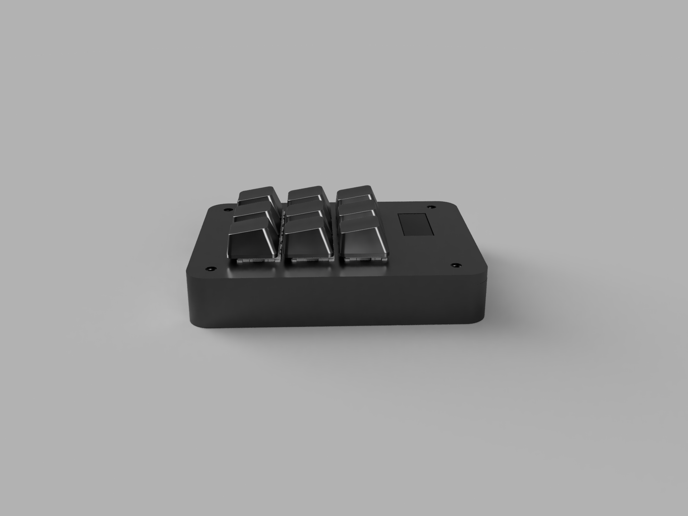
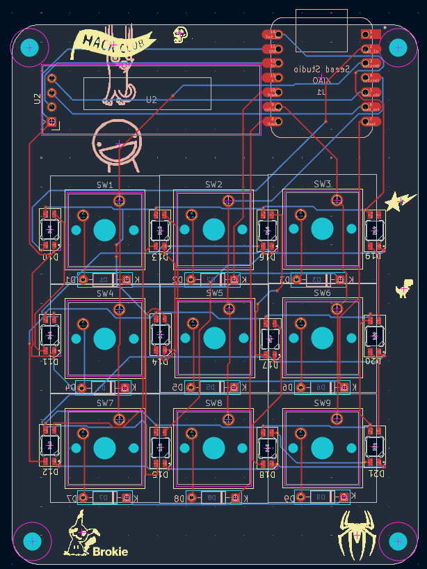
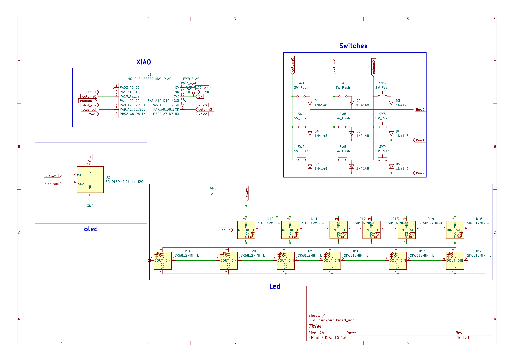

# Brokiepad – A 3x3 Macropad

### A compact, glowing macropad built for gaming, shortcuts, and looking cool on your desk.

*(Built for [Hackpad](https://hackpad.hackclub.com/), a Hack Club YSWS project.)*

---

## Renders

<p align="center">
  
  
</p>
<p align="center">
  
  
</p>
<p align="center">
  
  
</p>


---

## BOM

Full parts list with quantities and costs: **[BOM.md](BOM.md)**

---

## What is this?

Brokiepad is a **custom 3x3 macropad** built around the **Seeed Studio XIAO RP2040**, running **QMK firmware**, with an onboard **OLED display** and **9 SK6812MINI-E addressable LEDs**. Designed and routed from scratch in KiCad, with a 3D-printed case modeled to fit the switches and board exactly.

### Features:

- **3x3 Matrix** – 9 mechanical switches, fully remappable
- **OLED Display** – shows the brokiepad/brokie.3d brand on boot
- **9 SK6812MINI-E LEDs** – per-key style RGB lighting chain
- **QMK Firmware** – industry-standard, endlessly customizable
- **Custom KiCad PCB** – hand-routed matrix, diodes, and LED chain
- **3D-Printed Case** – designed to match the PCB and switch layout exactly

---

## Default Keymap

| Row | Key 1 | Key 2 | Key 3 |
|-----|-------|-------|-------|
| **1** | G | W | R |
| **2** | A | S | D |
| **3** | Left Shift | Caps Lock | Left Ctrl |

*(A WASD + modifiers gaming layout — remap it however you like in `keymap.c`.)*

---

## How to Use

1. **Flash the firmware** – Grab `brokiepad_default.uf2` from the `Firmware/` folder (or compile it yourself, see below).
2. **Put the XIAO RP2040 into bootloader mode** – hold the BOOT button while plugging it in via USB-C.
3. **Drag and drop** the `.uf2` file onto the drive that appears.
4. **Plug it back in normally** and start using it.

### Compiling it yourself

This uses [QMK Firmware](https://github.com/qmk/qmk_firmware). If you want to build from source:

```
qmk compile -kb brokiepad -km default
```

The keyboard files live in `Firmware/brokiepad/`.

---

## Hardware Details

- **MCU**: Seeed Studio XIAO RP2040
- **Switches**: 9x mechanical (see BOM for exact part)
- **Display**: SSD1306-style OLED, I2C
- **LEDs**: 9x SK6812MINI-E, daisy-chained
- **PCB**: Custom-designed in KiCad, diode matrix (COL2ROW)
- **Case**: 3D-printed, designed around the exact switch/board footprint

---

## Why?

I built this for [Hackpad](https://hackpad.hackclub.com/), a Hack Club YSWS project. I'm a self-taught 3D artist and hobbyist hardware tinkerer (**brokie.3d**), and this was my first full PCB-to-case-to-firmware build — designing the schematic, routing the board, modeling the case, and writing the firmware myself from scratch.

---

## License

This project is licensed under the [MIT License](LICENSE).
