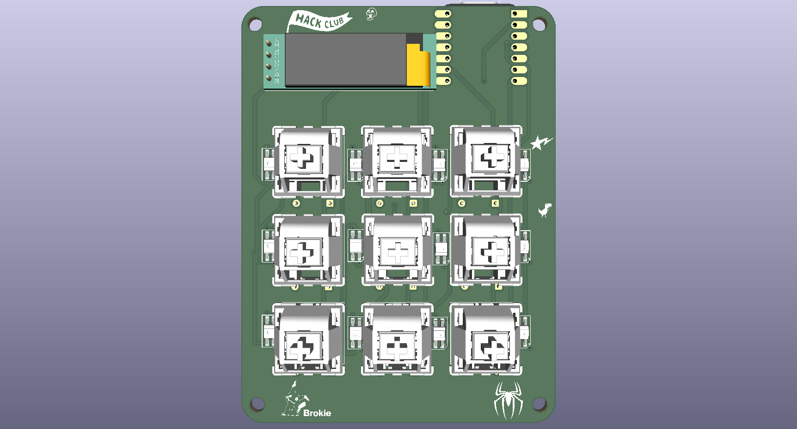
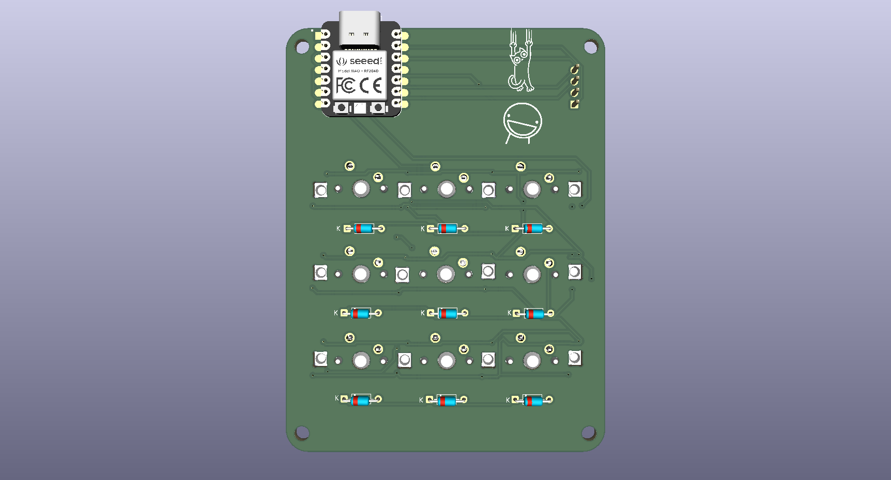
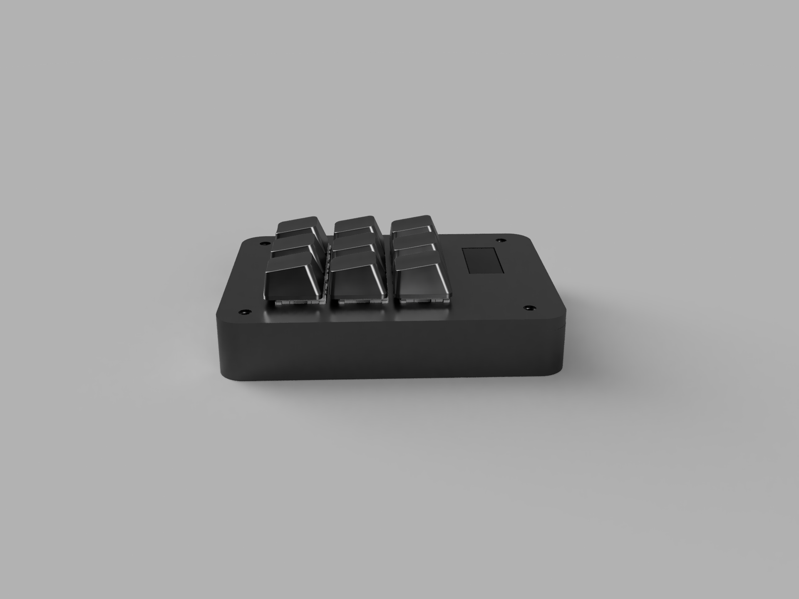
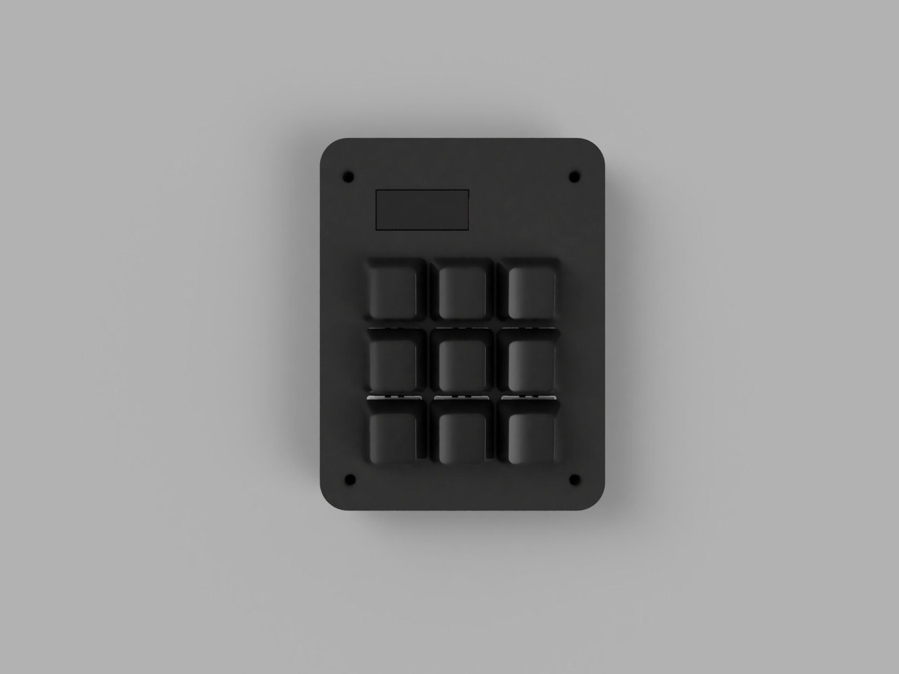
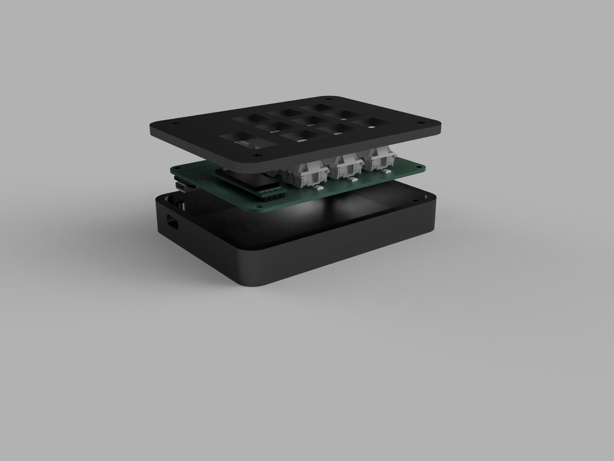
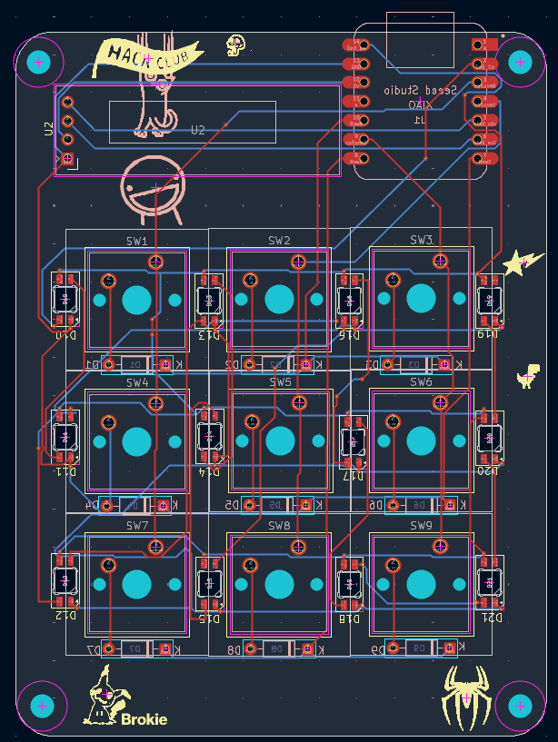
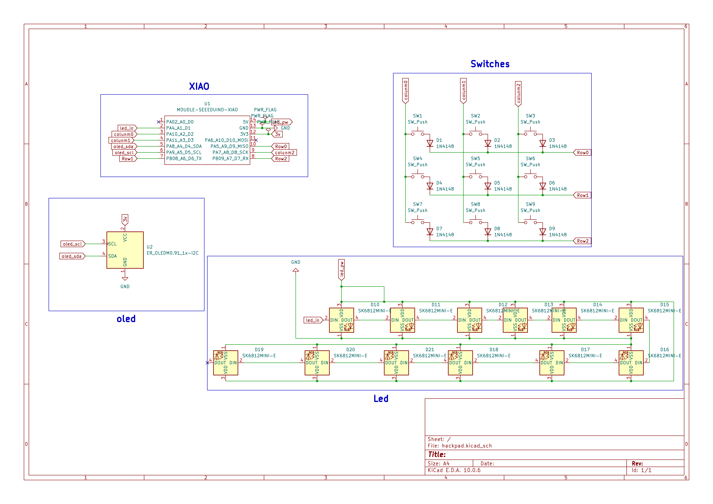

# Brokiepad – A 3x3 Macropad

### A simple and minimal 3*3 macropad with a built in oled display that can be customized to any use rn i have mapped it out as a gaming macropad using some of the basic keys that r needed while playing any game .

*(Built for [Hackpad](https://hackpad.hackclub.com/), a Hack Club YSWS project.)*

---
## Renders
- **PCB**

  
  

- **Case**
  

  

- **Explode view**
 

      

- **PCB layout**
 

  

- **Schematic**
 

   
 

  ---
## BOM

Full parts list with quantities and costs: **[BOM.csv](BOM.csv)**

---
### Features:

- **9 Mechanical Switches**
- **OLED Display** 
- **12 SK6812MINI-E LEDs**
- **QMK Firmware**
- **Custom KiCad PCB**
- **3D-Printed Case**

---

## Keymap rn 

| Row | Key 1 | Key 2 | Key 3 |
|-----|-------|-------|-------|
| **1** | G | W | R |
| **2** | A | S | D |
| **3** | Left Shift | Space | Left Ctrl |

## Why?

I built this for [Hackpad](https://hackpad.hackclub.com/), a Stardance project and i hope u like it (0_0) 

---

This project is licensed under the [MIT License](LICENSE).
